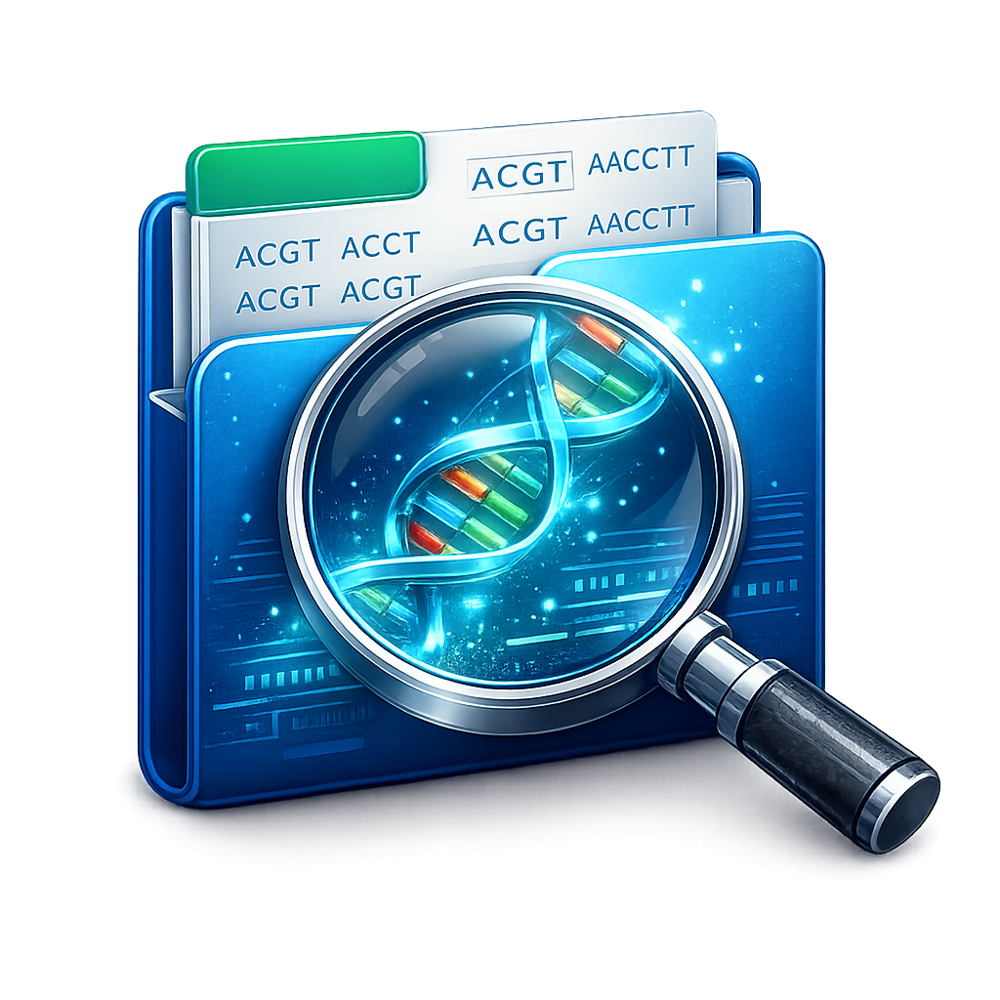
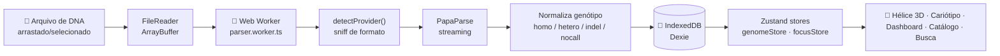
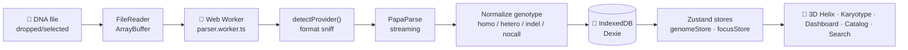

<div align="center">

<br />



<br /><br />

# DNA Explorer

**Plataforma web open-source para explorar DNA bruto no navegador — 100% client-side, privacidade por construção.**

*Open-source web platform to explore raw DNA in the browser — 100% client-side, privacy by design.*

<br />

[](https://github.com/caioross/DNAExplorer/actions)
[](https://opensource.org/licenses/MIT)
[](https://github.com/caioross/DNAExplorer)
[](https://nextjs.org)
[](https://react.dev)
[](https://typescriptlang.org)
[](https://threejs.org)
[](https://tailwindcss.com)

<br />

🇧🇷 [**Português**](#-português) · 🇺🇸 [**English**](#-english)

</div>

---

## 🇧🇷 Português
<a name="-português"></a>

### O que é

Quem compra um teste de DNA direto ao consumidor (Genera, 23andMe, AncestryDNA, MyHeritage…) recebe um relatório bonito mas raso — e o arquivo bruto com **~600 mil SNPs** fica esquecido numa pasta de downloads. **DNA Explorer** é a plataforma que muda isso.

Suba o arquivo. Em segundos, você tem:

| O que | Como |
|-------|------|
| 🧬 **Dupla hélice 3D** | React Three Fiber · geometria B-form fiel · Watson-Crick colorido |
| 🔬 **Cariótipo interativo** | Grade com os 25 cromossomos · drill-down por cromossomo |
| 📊 **Dashboard estatístico** | Distribuição de genótipos · cobertura por cromossomo · heterozigosidade |
| 📚 **Catálogo de variantes** | 100+ SNPs famosos pré-anotados (traços, saúde, farmacogenômica, nutrição, esporte) |
| 🔍 **Busca por rsID / gene** | Detalhe completo por variante com interpretações |

E tudo isso **sem sair do navegador**. Nenhum byte do seu DNA trafega pela rede.

> 📖 A visão completa — formatos de entrada, fontes de dados (ClinVar, gnomAD, GWAS, PharmGKB/CPIC, PGS Catalog, ABraOM), Polygenic Risk Scores, LGPD/ANPD e roadmap em 4 fases — está documentada em **[`DNAExplorer_Dossie.md`](./DNAExplorer_Dossie.md)**. Este README descreve o que já está **construído**.

---

### Recursos implementados

- **Upload + parsing em escala** — arrasta o arquivo; um **Web Worker** detecta o provedor, faz *streaming* com PapaParse, normaliza genótipo/no-calls/indels e grava ~600 mil SNPs no **IndexedDB via Dexie** em segundos com barra de progresso. A UI nunca trava.
- **Detecção automática de provedor** — Genera (CSV e TXT com aspas), 23andMe, AncestryDNA, MyHeritage e VCF genérico, normalizando tudo para um schema único.
- **Dupla hélice 3D** — React Three Fiber + drei, geometria B-form fiel, SNPs reais estratificados por cromossomo, pós-processamento com Bloom/Vignette; *backdrop* animado na landing.
- **Cariótipo interativo** — grade dos 25 cromossomos com drill-down por cromossomo (SNPs paginados a 500/página).
- **Catálogo de variantes canônicas** — biblioteca curada de rsIDs "famosos" com cards de interpretação, significância clínica e referências bibliográficas.
- **Dashboard estatístico** — gráficos Recharts (donut de genótipos, barras por cromossomo), taxa de heterozigosidade.
- **Busca por SNP** — rota `snp/[rsid]` com detalhe completo da variante.
- **Tema claro/escuro** sem *flash* — animações com Framer Motion, estado com Zustand, persistência em localStorage.

---

### Provedores suportados

| Provedor | Formatos |
|---------|---------|
| **Genera** | CSV (`;` separado) · TXT (valores com aspas) |
| **23andMe** | TSV (v4/v5) |
| **AncestryDNA** | TSV (allele1/allele2) |
| **MyHeritage** | CSV com aspas |
| **VCF** | Formato padrão genérico |

---

### Como rodar

```bash
# Instalar dependências
npm install

# Iniciar em desenvolvimento (porta 3737)
npm run dev
```

```bash
# Build de produção + servidor
npm run build && npm run start
```

> A porta padrão é **3737** (definida no `package.json`), não 3000.

Acesse em → **http://localhost:3737**

---

### Pipeline de dados



---

### Estrutura do projeto

<details>
<summary>Expandir estrutura de diretórios</summary>

```
app/
  page.tsx                           # landing page (Hero + backdrop 3D)
  layout.tsx                         # root layout, metadados SEO, fonts
  robots.ts                          # /robots.txt (crawlers)
  sitemap.ts                         # /sitemap.xml
  opengraph-image.tsx                # OG image gerada automaticamente
  globals.css                        # Tailwind base + design system
  viewer/
    layout.tsx                       # shell do viewer (topbar, tabs)
    page.tsx                         # dashboard principal
    helix/page.tsx                   # dupla hélice 3D
    chromosomes/page.tsx             # grade de cromossomos (cariótipo)
    chromosome/[chrom]/page.tsx      # detalhe de um cromossomo
    catalog/page.tsx                 # catálogo de variantes canônicas
    snp/[rsid]/page.tsx              # detalhe de um SNP

components/
  Hero.tsx                           # landing page
  Upload.tsx                         # dropzone, progresso, parsing UI
  Dashboard.tsx                      # stats, achados canônicos
  GenomeHelix.tsx                    # hélice 3D (R3F)
  HelixBackdrop.tsx                  # backdrop animado (landing)
  ChromosomeGrid.tsx                 # grade de cromossomos
  ChromosomeView.tsx                 # lista de SNPs por cromossomo
  CatalogView.tsx                    # browser do catálogo
  SnpDetail.tsx                      # card de detalhe de SNP
  GenotypeDonut.tsx                  # gráfico donut (Recharts)
  ChromBarChart.tsx                  # gráfico de barras (Recharts)
  ViewerShell.tsx                    # nav do viewer
  ThemeToggle.tsx · ThemeScript.tsx  # tema claro/escuro

lib/
  parser.worker.ts                   # parsing client-side em Web Worker
  detectProvider.ts                  # detecção e normalização de formato DTC
  db.ts                              # schema Dexie (IndexedDB)
  canonicalSnps.ts                   # ~100 variantes curadas
  chromosomeInfo.ts                  # metadados dos cromossomos
  genomeLayout.ts                    # geometria 3D do genoma
  dnaMolecule.ts                     # construção molecular 3D
  types.ts · utils.ts                # tipagem e utilitários
  stores/
    genomeStore.ts                   # status de parsing, perfil
    focusStore.ts                    # cromossomo/SNP em foco
    themeStore.ts                    # tema (dark/light)
```

</details>

---

### Privacidade

| Garantia | Detalhe |
|---------|---------|
| 🔒 **Zero upload** | Arquivo processado 100% no IndexedDB local — nenhum byte trafega pela rede |
| 🗑️ **Apagável** | Botão "Apagar tudo" elimina instantaneamente do IndexedDB |
| 🆔 **Apenas rsID** | Anotações buscadas por rsID (informação pública), nunca genótipo |
| 📋 **LGPD Art. 11** | Arquitetura nunca hospeda dados pessoais sensíveis |
| 👤 **Sem conta** | Nenhum cadastro, cookie de rastreamento ou analytics de terceiros |
| 🔓 **Código aberto** | MIT — auditável por qualquer pessoa |

---

### Roadmap

| Fase | Funcionalidade | Status |
|------|---------------|--------|
| **1** | Upload, parsing, detecção de provedor, IndexedDB | ✅ Concluído |
| **1** | Dashboard estatístico, gráficos Recharts | ✅ Concluído |
| **2** | Dupla hélice 3D (R3F) | ✅ Concluído |
| **2** | Cariótipo · grade de cromossomos · drill-down | ✅ Concluído |
| **2** | Catálogo canônico (~100 SNPs) · SnpDetail | ✅ Concluído |
| **3** | Anotações ao vivo (ClinVar · gnomAD · GWAS Catalog) | 🔜 Planejado |
| **3** | Integração PharmGKB/CPIC para farmacogenômica | 🔜 Planejado |
| **4** | Polygenic Risk Scores (PRS) | 🔜 Planejado |
| **4** | Modo imersivo · trilhas estilo UCSC | 🔜 Planejado |

---

### Stack

| Categoria | Tecnologias |
|-----------|-------------|
| **Framework** | Next.js 14 (App Router) · React 18 · TypeScript 5 |
| **3D / WebGL** | React Three Fiber · Three.js · @react-three/drei · Postprocessing |
| **Estilo** | Tailwind CSS 3 · Framer Motion · Lucide React |
| **Dados** | Dexie (IndexedDB) · Zustand · PapaParse (Web Worker) |
| **Gráficos** | Recharts |

---

### Contribuindo

Contribuições são muito bem-vindas! Áreas prioritárias:

- **Novos provedores** → veja `lib/detectProvider.ts` para adicionar suporte a FTDNA, LivingDNA, etc.
- **Novas variantes** → adicione entradas em `lib/canonicalSnps.ts` seguindo o schema `CanonicalSnp`
- **Integrações de API** → `app/api/annotations/[rsid]/` está preparado para ClinVar/gnomAD
- **Testes** → o projeto ainda não tem suite de testes (vitest/RTL são sugestões)
- **i18n** → UI está em pt-BR, inglês planejado

Abra uma issue antes de um PR grande para alinhar a direção. Código sensato, sem dependências desnecessárias.

---

### Licença

MIT © [Caio Ross](https://github.com/caioross) — veja [LICENSE](./LICENSE) para detalhes.

---

## 🇺🇸 English
<a name="-english"></a>

### What it is

Buy a direct-to-consumer DNA test (Genera, 23andMe, AncestryDNA, MyHeritage…) and you get a pretty but shallow report — while the raw file with **~600k SNPs** gathers dust. **DNA Explorer** changes that.

Drop your file. In seconds, you have:

| Feature | How |
|---------|-----|
| 🧬 **3D double helix** | React Three Fiber · faithful B-form geometry · Watson-Crick coloring |
| 🔬 **Interactive karyotype** | 25-chromosome grid · per-chromosome drill-down |
| 📊 **Statistical dashboard** | Genotype distribution · per-chromosome coverage · heterozygosity |
| 📚 **Variant catalog** | 100+ pre-annotated famous SNPs (traits, health, pharmacogenomics, nutrition, sport) |
| 🔍 **rsID / gene search** | Full per-variant detail with interpretations |

And all of it **without leaving the browser**. Not a single byte of your DNA travels over the network.

> 📖 The full project vision — input formats, data sources (ClinVar, gnomAD, GWAS, PharmGKB/CPIC, PGS Catalog, ABraOM), Polygenic Risk Scores, privacy considerations, and the 4-phase roadmap — lives in **[`DNAExplorer_Dossie.md`](./DNAExplorer_Dossie.md)** (in Portuguese). This README describes what is already **built**.

---

### Implemented features

- **Upload + parsing at scale** — drop the file; a **Web Worker** detects the provider, streams with PapaParse, normalizes genotype/no-calls/indels and writes ~600k SNPs to **IndexedDB via Dexie** in seconds with a progress bar. The UI never freezes.
- **Automatic provider detection** — Genera (CSV and quoted TXT), 23andMe, AncestryDNA, MyHeritage, and generic VCF — all normalized to a single schema.
- **3D double helix** — React Three Fiber + drei, faithful B-form geometry, real SNPs stratified by chromosome, Bloom/Vignette post-processing; animated backdrop on the landing page.
- **Interactive karyotype** — 25-chromosome grid with per-chromosome drill-down (SNPs paginated at 500/page).
- **Canonical variant catalog** — curated library of "famous" rsIDs with interpretation cards, clinical significance, and bibliographic references.
- **Statistical dashboard** — Recharts charts (genotype donut, per-chromosome bars), heterozygosity rate.
- **SNP search** — `snp/[rsid]` route with full per-variant detail.
- **Light/dark theme** without flash — Framer Motion animations, Zustand state, localStorage persistence.

---

### Supported providers

| Provider | Formats |
|----------|---------|
| **Genera** | CSV (`;`-separated) · TXT (quoted values) |
| **23andMe** | TSV (v4/v5) |
| **AncestryDNA** | TSV (allele1/allele2) |
| **MyHeritage** | Quoted CSV |
| **VCF** | Generic standard format |

---

### How to run

```bash
# Install dependencies
npm install

# Start development server (port 3737)
npm run dev
```

```bash
# Production build + server
npm run build && npm run start
```

> The default port is **3737** (set in `package.json`), not 3000.

Open → **http://localhost:3737**

---

### Data pipeline



---

### Privacy

| Guarantee | Detail |
|-----------|--------|
| 🔒 **Zero upload** | File processed 100% in local IndexedDB — no bytes travel over the network |
| 🗑️ **Clearable** | "Delete all" button instantly wipes the IndexedDB |
| 🆔 **rsID only** | Annotations fetched by rsID (public info), never genotype |
| 📋 **LGPD Art. 11** | Architecture never hosts sensitive personal data |
| 👤 **No account** | No sign-up, tracking cookies, or third-party analytics |
| 🔓 **Open source** | MIT — auditable by anyone |

---

### Roadmap

| Phase | Feature | Status |
|-------|---------|--------|
| **1** | Upload, parsing, provider detection, IndexedDB | ✅ Done |
| **1** | Statistical dashboard, Recharts charts | ✅ Done |
| **2** | 3D double helix (R3F) | ✅ Done |
| **2** | Karyotype · chromosome grid · drill-down | ✅ Done |
| **2** | Canonical catalog (~100 SNPs) · SnpDetail | ✅ Done |
| **3** | Live annotations (ClinVar · gnomAD · GWAS Catalog) | 🔜 Planned |
| **3** | PharmGKB/CPIC pharmacogenomics integration | 🔜 Planned |
| **4** | Polygenic Risk Scores (PRS) | 🔜 Planned |
| **4** | Immersive mode · UCSC-style tracks | 🔜 Planned |

---

### Tech stack

| Category | Technologies |
|----------|-------------|
| **Framework** | Next.js 14 (App Router) · React 18 · TypeScript 5 |
| **3D / WebGL** | React Three Fiber · Three.js · @react-three/drei · Postprocessing |
| **Styling** | Tailwind CSS 3 · Framer Motion · Lucide React |
| **Data** | Dexie (IndexedDB) · Zustand · PapaParse (Web Worker) |
| **Charts** | Recharts |

---

### Contributing

Contributions are very welcome! Priority areas:

- **New providers** → see `lib/detectProvider.ts` to add FTDNA, LivingDNA, etc.
- **New variants** → add entries to `lib/canonicalSnps.ts` following the `CanonicalSnp` schema
- **API integrations** → `app/api/annotations/[rsid]/` is ready for ClinVar/gnomAD
- **Tests** → no test suite yet (vitest/RTL are good suggestions)
- **i18n** → UI is in pt-BR; English is planned

Open an issue before a large PR to align direction. Clean code, no unnecessary dependencies.

---

### License

MIT © [Caio Ross](https://github.com/caioross) — see [LICENSE](./LICENSE) for details.

---

<div align="center">

*Parte do ecossistema de projetos de **Caio** · Part of **Caio**'s project ecosystem.*

</div>
