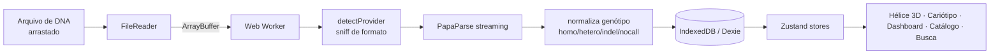
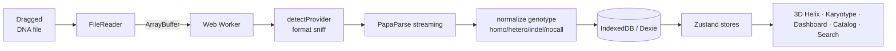

<div align="center">

# 🧬 DNA Explorer

### Seu DNA bruto, explorável no navegador · *Your raw DNA, explorable in the browser*

**Suba o arquivo bruto de qualquer teste de DNA (Genera, 23andMe, AncestryDNA…) e navegue seu genoma em 3D — 100% client-side, o arquivo nunca sai do navegador.**
*Upload the raw file from any DNA test and explore your genome in 3D — 100% client-side, your file never leaves the browser.*


🇧🇷 [**Português**](#-português) · 🇺🇸 [**English**](#-english)

</div>

---

## 🇧🇷 Português
<a name="-português"></a>

### O que é

Quem compra um teste DTC (Genera, 23andMe, AncestryDNA, MyHeritage…) recebe um relatório bonito mas raso, e o arquivo bruto com ~600 mil SNPs fica esquecido. **DNA Explorer** é uma plataforma web aberta onde você sobe esse arquivo bruto e o navega de verdade: dupla hélice 3D, cariótipo, dashboards estatísticos, catálogo de variantes famosas e busca por rsID/gene — tudo **no navegador**, sem servidor de armazenamento. O DNA nunca sai do seu computador (LGPD-compliant por construção).

> 📖 A visão completa do projeto — formatos de entrada, fontes de dados (ClinVar, gnomAD, GWAS, PharmGKB/CPIC, PGS Catalog, ABraOM), Polygenic Risk Scores, considerações de LGPD/ANPD e o roadmap em 4 fases — está documentada em **[`DNAExplorer_Dossie.md`](./DNAExplorer_Dossie.md)**. Este README descreve o que já está **construído** no código.

### Recursos (implementado)

- **Upload + parsing em escala** — arrasta o arquivo; um **Web Worker** detecta o provedor, faz *streaming* com PapaParse, normaliza genótipo/no-calls/indels e grava ~600k SNPs no **IndexedDB via Dexie** em segundos, com barra de progresso. Sua máquina nunca trava (`lib/parser.worker.ts`, `lib/detectProvider.ts`, `lib/db.ts`).
- **Detecção automática de provedor** — Genera (CSV e TXT com aspas), 23andMe, AncestryDNA, MyHeritage e VCF genérico, normalizando tudo para um schema único.
- **Dupla hélice 3D** — `GenomeHelix` em **React Three Fiber + drei**, geometria B-form fiel, navegável; *backdrop* animado na landing.
- **Cariótipo / grade de cromossomos** — visão geral do genoma (`ChromosomeGrid`) com drill-down por cromossomo (`chromosome/[chrom]`).
- **Catálogo de variantes canônicas** — biblioteca curada de rsIDs "famosos" (traços, saúde, farmacogenômica, nutrigenômica, esporte) em `lib/canonicalSnps.ts`, com cards de interpretação (`CatalogView`, `SnpDetail`).
- **Dashboard estatístico** — distribuição de genótipos (donut), cobertura por cromossomo (barras), heterozigose — com **Recharts**.
- **Busca por SNP** — rota `snp/[rsid]` com detalhe da variante.
- **Tema claro/escuro** sem *flash*, animações com **framer-motion**, estado com **Zustand**.

### Como rodar

```bash
npm install
npm run dev        # abre em http://localhost:3737
```

```bash
npm run build      # build de produção
npm run start      # serve o build (porta 3737)
```

> A porta padrão é **3737** (definida no `package.json`), não 3000.

### Estrutura

```
app/
  page.tsx                       # landing (Hero + backdrop 3D)
  layout.tsx
  viewer/
    layout.tsx                   # shell do viewer (sidebar + topbar)
    page.tsx                     # entrada (upload / dashboard)
    helix/page.tsx               # dupla hélice 3D
    chromosomes/page.tsx         # grade de cromossomos
    chromosome/[chrom]/page.tsx  # detalhe de um cromossomo
    catalog/page.tsx             # catálogo de variantes canônicas
    snp/[rsid]/page.tsx          # detalhe de um SNP
components/                      # Upload, Dashboard, GenomeHelix, CatalogView,
                                 # SnpDetail, ChromosomeGrid/View, GenotypeDonut,
                                 # ChromBarChart, ViewerShell, Hero, ThemeToggle…
lib/
  parser.worker.ts               # parsing client-side em Web Worker
  detectProvider.ts              # detecção de formato DTC
  db.ts                          # schema Dexie (IndexedDB)
  canonicalSnps.ts               # variantes "famosas" curadas
  chromosomes.ts · chromosomeInfo.ts · genomeLayout.ts · dnaMolecule.ts
  stores/                        # genomeStore, focusStore, themeStore (Zustand)
  types.ts · utils.ts
```

### Pipeline de dados



### Privacidade

100% client-side. O arquivo é processado e armazenado **apenas no IndexedDB do seu navegador** — nada é enviado para nenhum servidor. Conteúdo **educacional**, não diagnóstico (ver disclaimer no `DNAExplorer_Dossie.md`). O `.gitignore` exclui a pasta de dados pessoais (`dna_caio/`).

### Status

Fases 1–2 do roadmap em andamento (upload, parsing, dashboard, cariótipo, catálogo, hélice 3D). Integrações de anotação ao vivo (ClinVar/gnomAD/GWAS), PRS e modo imersivo estão planejados — ver o dossiê.

---

## 🇺🇸 English
<a name="-english"></a>

### What it is

Buy a DTC test (Genera, 23andMe, AncestryDNA, MyHeritage…) and you get a pretty but shallow report, while the raw file with ~600k SNPs gathers dust. **DNA Explorer** is an open web platform where you upload that raw file and actually explore it: a 3D double helix, a karyotype, statistical dashboards, a catalog of famous variants and rsID/gene search — all **in the browser**, with no storage server. Your DNA never leaves your computer (privacy-compliant by design).

> 📖 The full project vision — input formats, data sources (ClinVar, gnomAD, GWAS, PharmGKB/CPIC, PGS Catalog, ABraOM), Polygenic Risk Scores, privacy considerations and the 4-phase roadmap — lives in **[`DNAExplorer_Dossie.md`](./DNAExplorer_Dossie.md)** (in Portuguese). This README describes what is already **built** in code.

### Features (implemented)

- **Upload + parsing at scale** — drop the file; a **Web Worker** detects the provider, streams with PapaParse, normalizes genotype/no-calls/indels and writes ~600k SNPs to **IndexedDB via Dexie** in seconds, with a progress bar. The UI never freezes.
- **Automatic provider detection** — Genera (CSV and quoted TXT), 23andMe, AncestryDNA, MyHeritage and generic VCF, normalized to a single schema.
- **3D double helix** — `GenomeHelix` in **React Three Fiber + drei**, faithful B-form geometry, navigable; animated backdrop on the landing.
- **Karyotype / chromosome grid** — genome overview with per-chromosome drill-down.
- **Canonical variant catalog** — a curated library of "famous" rsIDs (traits, health, pharmacogenomics, nutrigenomics, sport) in `lib/canonicalSnps.ts`, with interpretation cards.
- **Statistical dashboard** — genotype distribution (donut), per-chromosome coverage (bars), heterozygosity — with **Recharts**.
- **SNP search** — `snp/[rsid]` route with per-variant detail.
- **Light/dark theme** with no flash, **framer-motion** animations, **Zustand** state.

### How to run

```bash
npm install
npm run dev        # opens at http://localhost:3737
```

```bash
npm run build      # production build
npm run start      # serve the build (port 3737)
```

> The default port is **3737** (set in `package.json`), not 3000.

### Structure

```
app/
  page.tsx                       # landing (Hero + 3D backdrop)
  viewer/
    helix/         · 3D double helix
    chromosomes/   · chromosome grid
    chromosome/[chrom]/ · single-chromosome detail
    catalog/       · canonical variant catalog
    snp/[rsid]/    · single-SNP detail
components/        # Upload, Dashboard, GenomeHelix, CatalogView, SnpDetail, …
lib/
  parser.worker.ts · detectProvider.ts · db.ts (Dexie)
  canonicalSnps.ts · chromosomes.ts · genomeLayout.ts
  stores/          · genomeStore, focusStore, themeStore (Zustand)
```

### Data pipeline



### Privacy

100% client-side. The file is parsed and stored **only in your browser's IndexedDB** — nothing is uploaded anywhere. **Educational** content, not diagnostic (see the disclaimer in the dossier). The `.gitignore` excludes the personal-data folder (`dna_caio/`).

### Status

Roadmap phases 1–2 in progress (upload, parsing, dashboard, karyotype, catalog, 3D helix). Live annotation integrations (ClinVar/gnomAD/GWAS), PRS and the immersive mode are planned — see the dossier.

---

<div align="center">

*Parte do ecossistema de projetos de **Caio**.*

</div>
